# Palia Garden Planner - React Port Technical Implementation

## Overview

This document provides detailed technical specifications and implementation details for the React port of the Palia Garden Planner application. The port maintains the original Vue.js application's functionality while leveraging React's ecosystem and modern development practices.

## Architecture Overview

The application follows a modular architecture with clear separation of concerns:

- **Core Data Layer**: TypeScript classes for business logic
- **State Management**: Zustand stores for application state
- **UI Components**: React components with TypeScript
- **Styling**: Tailwind CSS v4 with custom Palia theme

### Architecture Diagrams

#### 1. High-Level System Overview


#### 2. State Management Architecture

```mermaid
graph LR
    A["React Components"] --> B["Zustand Stores"]

    B --> B1["useGarden<br/>🏡 Garden State"]
    B --> B2["useSelectedItem<br/>🎯 Selection State"]
    B --> B3["useToasts<br/>📢 Notifications"]
    B --> B4["useUISettings<br/>⚙️ User Preferences"]

    B1 --> C1["Garden Instance<br/>Loading States<br/>Error Handling"]
    B2 --> C2["Selected Crop<br/>Selected Fertiliser<br/>Erase Mode"]
    B3 --> C3["Toast Queue<br/>Auto-dismiss<br/>Toast Types"]
    B4 --> C4["UI Toggles<br/>localStorage<br/>Persistence"]

    C4 --> D["localStorage<br/>Browser Persistence"]
```



#### 3. Core Data Layer Architecture

```mermaid
graph TD
    A["Core Data Layer"] --> B["Classes"]
    A --> C["Enums"]
    A --> D["Types"]
    A --> E["Data Files"]

    B --> B1["Garden<br/>🏡 Top-level container<br/>Plot[][] management"]
    B --> B2["Plot<br/>📋 3x3 Tile grid<br/>Adjacency tracking"]
    B --> B3["Tile<br/>🔲 Individual cell<br/>Crop + Fertiliser"]
    B --> B4["Crop<br/>🌱 Growth calculations<br/>Yield projections"]
    B --> B5["Fertiliser<br/>💧 Bonus effects<br/>Enhancement logic"]

    C --> C1["Bonus<br/>✨ Effect types"]
    C --> C2["Direction<br/>🧭 Adjacency"]
    C --> C3["CropType<br/>🌾 16 Palia crops"]
    C --> C4["FertiliserType<br/>💊 5 fertiliser types"]
    C --> C5["CropSize<br/>📏 Single/Bush/Tree"]

    D --> D1["PlotStat<br/>📊 Statistics interface"]

    E --> E1["cropList.ts<br/>🌱 Crop definitions"]
    E --> E2["fertiliserList.ts<br/>💧 Fertiliser data"]

    B1 --> B2
    B2 --> B3
    B3 --> B4
    B3 --> B5
```



#### 4. Data Flow Architecture


#### 5. Component Hierarchy (Planned for Phase 2+)


#### 6. Technology Stack Integration

```mermaid
graph LR
    A["Next.js 15.2.3<br/>🚀 Framework"] --> B["React 19<br/>⚛️ UI Library"]
    A --> C["TypeScript 5.7.3<br/>📝 Type Safety"]
    A --> D["Tailwind CSS v4<br/>🎨 Styling"]

    B --> E["Zustand<br/>🗄️ State Management"]
    B --> F["React Testing Library<br/>🧪 Testing"]

    C --> G["Strict Mode<br/>✅ Null Checking"]
    C --> H["Path Aliases<br/>📁 Clean Imports"]

    D --> I["Palia Theme<br/>🎮 Game Colors"]
    D --> J["Responsive Design<br/>📱 Mobile Support"]

    E --> K["Persistence<br/>💾 localStorage"]
    E --> L["Type Safety<br/>🔒 Full TypeScript"]
```



## Technology Stack

### Core Technologies

- **React 19** - UI library with latest hooks and concurrent features
- **Next.js 15.2.3** - Full-stack React framework
- **TypeScript 5.7.3** - Type safety and developer experience
- **Tailwind CSS v4** - Utility-first CSS framework

### State Management

- **Zustand** - Lightweight state management (chosen over Redux for simplicity)

### Development Tools

- **ESLint** - Code linting and quality
- **Prettier** - Code formatting
- **Vitest** - Unit testing framework
- **Testing Library** - React component testing

### Additional Libraries

- **Radix UI** - Accessible UI primitives
- **Framer Motion** - Animation library
- **html2canvas** - Screenshot generation
- **date-fns** - Date utilities
- **uniqid** - Unique ID generation

## Project Structure

```
apps/web/
├── lib/garden-planner/          # Core business logic
│   ├── classes/                 # Data classes (Garden, Plot, Tile, etc.)
│   ├── enums/                   # TypeScript enums
│   ├── types/                   # Type definitions
│   ├── cropList.ts             # Crop data
│   ├── fertiliserList.ts       # Fertiliser data
│   └── index.ts                # Main exports
├── stores/                      # Zustand state stores
│   ├── useGarden.ts            # Garden state management
│   ├── useSelectedItem.ts      # Item selection state
│   ├── useToasts.ts            # Notification system
│   ├── useUISettings.ts        # UI preferences
│   └── index.ts                # Store exports
├── components/                  # React components (Phase 2+)
├── hooks/                       # Custom React hooks (Phase 2+)
└── app/                        # Next.js app directory
```

## Core Data Architecture

The application's data layer consists of interconnected TypeScript classes that manage the garden planning logic:

### Class Hierarchy

1. **Garden** - Top-level container managing Plot[][]
2. **Plot** - 3x3 grid of tiles with adjacency relationships
3. **Tile** - Individual garden cell with crop/fertiliser
4. **Crop** - Crop definitions with growth/yield calculations
5. **Fertiliser** - Fertiliser effects and bonuses

### Enums and Types

- **Bonus**: WaterRetain, HarvestIncrease, QualityIncrease, SpeedIncrease, WeedPrevention
- **Direction**: North, South, East, West (for adjacency)
- **CropType**: 16 different crop types from Palia
- **FertiliserType**: 5 fertiliser types with different effects
- **CropSize**: Single, Bush, Tree (affects tile occupation)

## State Management Architecture

The application uses Zustand for state management with the following stores:

### useGarden Store

```typescript
interface GardenState {
  garden: Garden | null;
  isLoading: boolean;
  error: string | null;
  // Actions
  initializeGarden: (rows: number, cols: number) => void;
  clearGarden: () => void;
  // ... other actions
}
```

### useSelectedItem Store

```typescript
interface SelectedItemState {
  selectedCrop: CropType | null;
  selectedFertiliser: FertiliserType | null;
  isEraseMode: boolean;
  // Actions
  selectCrop: (crop: CropType) => void;
  selectFertiliser: (fertiliser: FertiliserType) => void;
  toggleEraseMode: () => void;
}
```

### useToasts Store

```typescript
interface ToastState {
  toasts: Toast[];
  // Actions
  addToast: (toast: Omit<Toast, "id">) => void;
  removeToast: (id: string) => void;
  clearToasts: () => void;
}
```

### useUISettings Store

```typescript
interface UISettingsState {
  showBonusIndicators: boolean;
  showGridLines: boolean;
  showTooltips: boolean;
  isDarkMode: boolean;
  isCompactMode: boolean;
  autoSave: boolean;
  // Actions with persistence
  toggleBonusIndicators: () => void;
  // ... other toggles
}
```

## Implementation Details

### Phase 1 Completion Summary

**Completed Tasks:**

1. **Project Structure Setup** (2 hours)

   - Next.js 15.2.3 with React 19 setup
   - TypeScript 5.7.3 configuration with strict mode
   - Tailwind CSS v4 with Palia color theme
   - Path aliases configuration
   - ESLint and development tools

2. **Core Data Classes Port** (3 hours)

   - All essential classes ported and tested
   - TypeScript strict null checking compliance
   - Comprehensive enum definitions
   - Data files (cropList, fertiliserList) ported
   - Unit tests written and passing

3. **State Management Setup** (1 hour)
   - Zustand stores implemented
   - Type-safe state management
   - localStorage persistence for UI settings
   - Toast notification system

**Total Phase 1 Time**: ~6 hours (under original 14-18 hour estimate)

### Phase 2 Completion Summary

**Completed Tasks:**

1. **Basic Layout Components** (2 hours)

   - GardenPlanner main component with responsive layout
   - Toast notification system (ToastContainer, Toast components)
   - Component composition patterns established
   - Error handling and loading states

2. **Garden Grid Display** (4 hours)

   - GardenDisplay component with garden state integration
   - PlotGrid component for rendering plot arrays
   - PlotComponent with 3x3 tile grid and hover effects
   - TileComponent with click interactions and visual feedback
   - Basic bonus visualization indicators
   - Responsive grid layout with proper scaling

3. **Item Selector Component** (2 hours)
   - Complete ItemSelector with tabbed interface (Crops/Fertilisers/Tools)
   - Crop selection from cropList with growth time display
   - Fertiliser selection from fertiliserList with effect display
   - Erase mode and clear selection tools
   - Visual selection state indicators
   - Keyboard shortcut UI indicators

**Total Phase 2 Time**: ~8 hours (under original 26-33 hour estimate)

### Key Technical Decisions

1. **Zustand over Redux**: Chosen for simplicity and smaller bundle size
2. **Class Preservation**: Maintained original TypeScript classes to preserve business logic
3. **Strict TypeScript**: Used strict null checking with proper error handling
4. **Modular Architecture**: Clear separation between data layer, state, and UI
5. **Tailwind v4**: Leveraged existing project setup with Palia-specific extensions

### Performance Considerations

- **Lazy Loading**: Components will be lazy-loaded in Phase 2+
- **Memoization**: React.memo and useMemo for expensive calculations
- **State Optimization**: Zustand's selective subscriptions prevent unnecessary re-renders
- **Bundle Splitting**: Next.js automatic code splitting

### Testing Strategy

- **Unit Tests**: Core classes and utility functions
- **Integration Tests**: State management and data flow
- **Component Tests**: React Testing Library for UI components (Phase 2+)
- **E2E Tests**: Playwright for full user workflows (Phase 5)

## Color Theme Implementation

### Tailwind CSS Extensions

```typescript
// Palia-specific colors added to Tailwind config
colors: {
  'palia-blue': '#4A90E2',
  'bonus-water-retain': '#3498db',
  'bonus-harvest-boost': '#e74c3c',
  'bonus-quality-increase': '#9b59b6',
  'bonus-weed-prevention': '#2ecc71',
  'bonus-speed-increase': '#f39c12',
  'bonus-gold': '#f1c40f',
  'bonus-star': '#e67e22'
}
```

## Next Steps (Phase 2)

The foundation is now ready for UI component development:

1. **GardenDisplay Component** - Interactive garden grid
2. **Plot Component** - 3x3 tile grid with hover effects
3. **Tile Component** - Individual tile with crop/fertiliser display
4. **ItemSelector Component** - Crop and fertiliser selection interface

## Error Handling

- **TypeScript Strict Mode**: Compile-time error prevention
- **Runtime Validation**: Input validation in state actions
- **Error Boundaries**: React error boundaries for UI components (Phase 2+)
- **Toast Notifications**: User-friendly error messaging

## Accessibility Considerations

- **Keyboard Navigation**: Full keyboard support for all interactions
- **Screen Reader Support**: Proper ARIA labels and descriptions
- **Color Contrast**: WCAG 2.1 AA compliance
- **Focus Management**: Logical tab order and focus indicators

## Browser Compatibility

- **Modern Browsers**: Chrome 90+, Firefox 88+, Safari 14+, Edge 90+
- **Mobile Support**: iOS Safari 14+, Android Chrome 90+
- **Progressive Enhancement**: Core functionality works without JavaScript

## Performance Benchmarks

Target performance metrics for Phase 2+:

- **First Contentful Paint**: < 1.5s
- **Largest Contentful Paint**: < 2.5s
- **Cumulative Layout Shift**: < 0.1
- **First Input Delay**: < 100ms

---

_This document will be updated as implementation progresses through subsequent phases._
