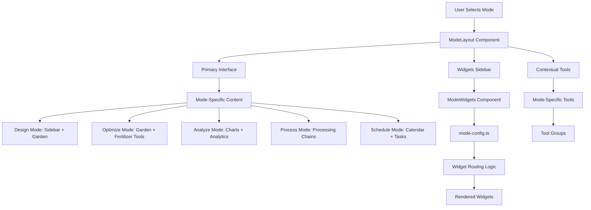
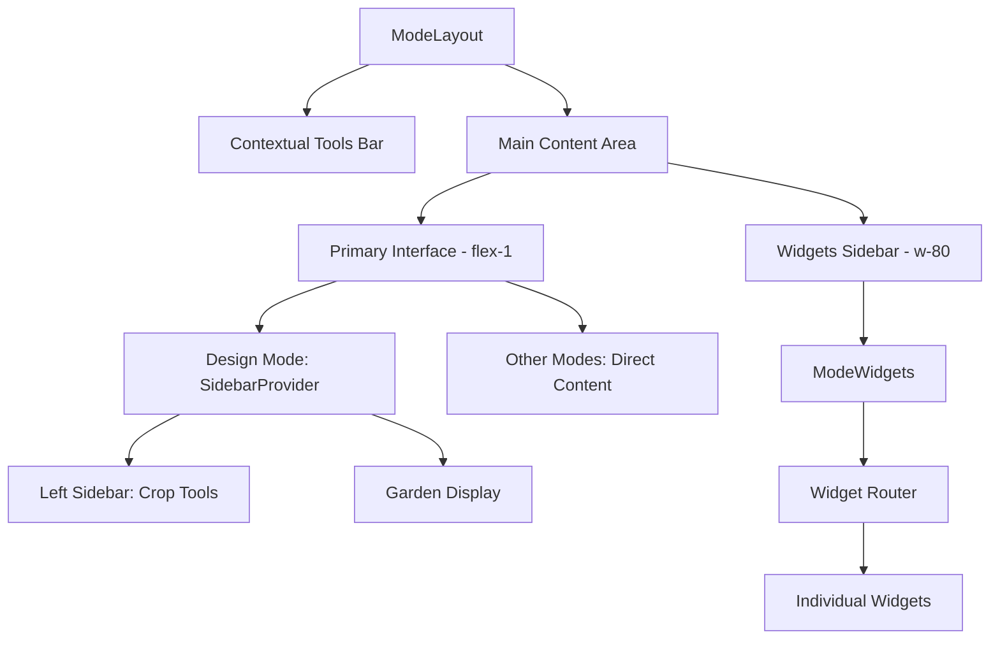
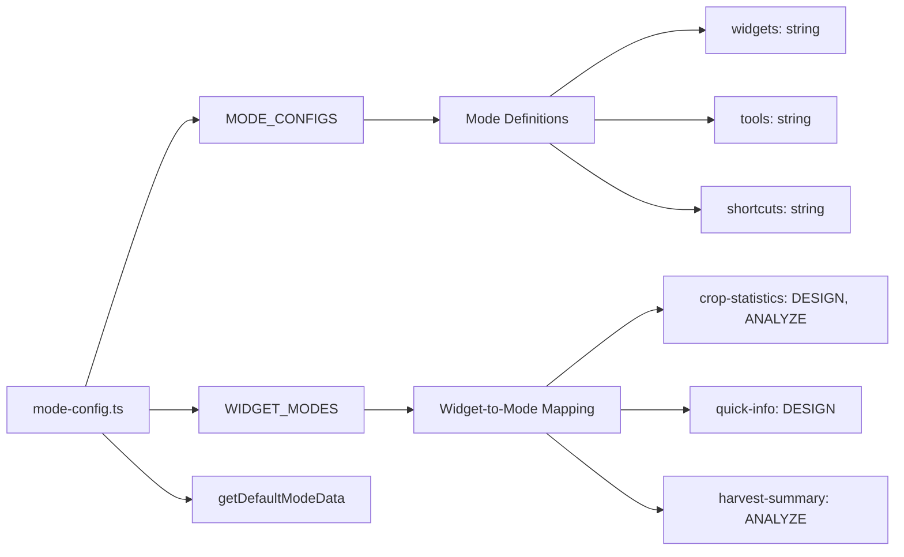
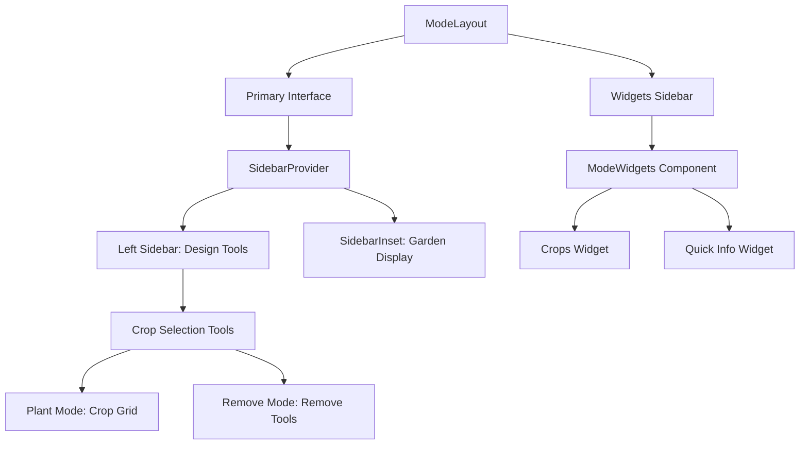
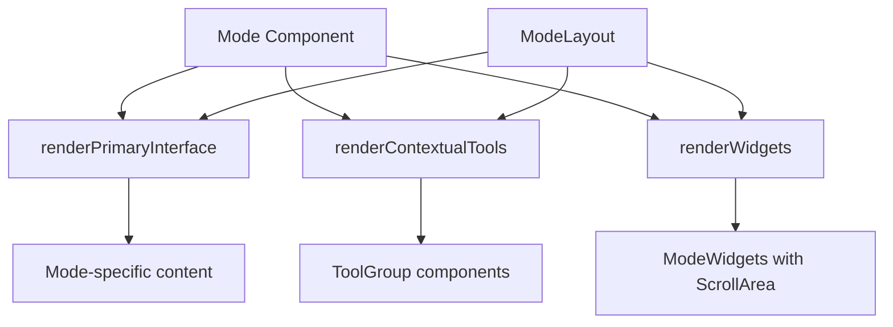
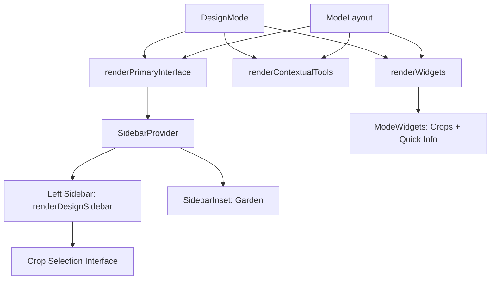
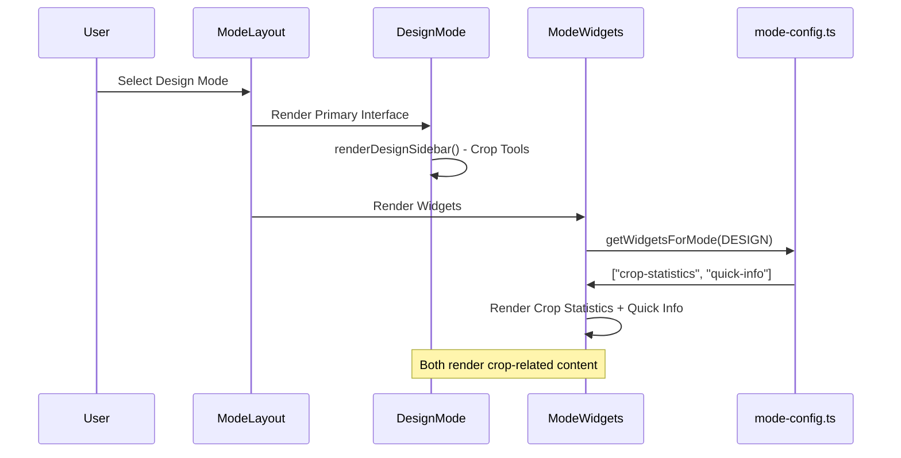
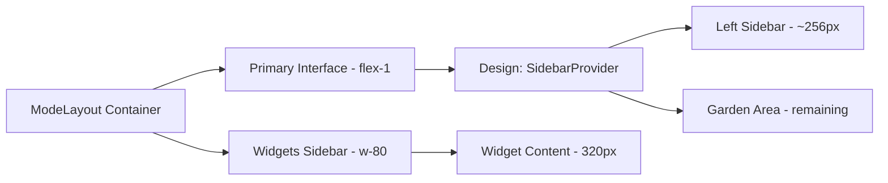

# Palia Garden Planner Mode System Documentation

## Overview

The Palia Garden Planner uses a sophisticated mode-based architecture that allows users to switch between different garden management contexts (Design, Optimize, Analyze, Process, Schedule). Each mode provides specialized tools and widgets relevant to its specific purpose.

## Architecture Components

### Core Components

1. **`base-mode.tsx`** - Provides the foundational layout and lifecycle management
2. **Mode Components** - Individual mode implementations (Design, Optimize, etc.)
3. **`mode-config.ts`** - Configuration and widget routing system
4. **Widget System** - Reusable UI components that appear in the right sidebar

## System Flow Diagram



## Component Hierarchy



## Mode Configuration System



## Widget Duplication Issue Explanation

The "Crops" and "Quick Info" widgets appearing twice is likely due to the **dual layout system** in Design Mode:

### Current Design Mode Layout Structure



### Why Duplication Occurs

1. **Left Sidebar (Design Tools)**: Contains crop selection interface with crop buttons organized by bonus type
2. **Right Sidebar (Widgets)**: Contains `ModeWidgets` which renders "Crops" and "Quick Info" widgets based on `mode-config.ts`

The duplication happens because:

- The **left sidebar** shows crop selection tools (part of the mode's primary interface)
- The **right sidebar** shows crop statistics widgets (configured in `MODE_CONFIGS[DESIGN].widgets`)

## Mode Implementation Patterns

### Standard Mode Pattern (Optimize, Analyze, Process, Schedule)



### Design Mode Pattern (Special Case)



## Data Flow



## Configuration Details

### MODE_CONFIGS Structure

```typescript
[GardenMode.DESIGN]: {
    widgets: ["crop-statistics", "quick-info"],  // Right sidebar widgets
    tools: ["crop-selector", "pattern-tools"],   // Contextual tools
    shortcuts: ["1", "c", "p", "g"]             // Keyboard shortcuts
}
```

### Widget Routing Logic

```typescript
WIDGET_MODES: {
    "crop-statistics": [GardenMode.DESIGN, GardenMode.ANALYZE],
    "quick-info": [GardenMode.DESIGN]
}
```

## Layout Dimensions



## Solution to Duplication

To fix the duplication, you would need to:

1. **Remove widgets** from Design mode config, OR
2. **Customize widget content** to show different information, OR
3. **Modify the layout** to integrate tools and widgets better

The current system works as designed - it's just that Design mode has both integrated tools (left sidebar) and configured widgets (right sidebar) that happen to show similar crop-related information.
