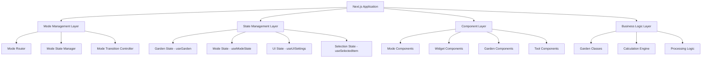

# Palia Garden Helper UI Redesign - Technical Implementation Guide

## Overview

This document provides comprehensive technical specifications for implementing the mode-based UI redesign of the Palia Garden Helper. The implementation maintains all existing functionality while introducing a sophisticated mode-based architecture that reduces cognitive load and improves user experience.

## Architecture Overview

### System Architecture



### Core Design Principles

1. **Mode-First Architecture**: All UI components are designed around the 5-mode system
2. **Progressive Disclosure**: Information complexity increases with user interaction depth
3. **State Preservation**: User context and selections persist across mode switches
4. **Performance Optimization**: Lazy loading and efficient rendering for smooth transitions
5. **Accessibility First**: Full keyboard navigation and screen reader support

## Mode System Implementation

### Mode Definition and Types

```typescript
// Mode system types
export enum GardenMode {
  DESIGN = "design",
  OPTIMIZE = "optimize",
  ANALYZE = "analyze",
  PROCESS = "process",
  SCHEDULE = "schedule",
}

export interface ModeConfig {
  id: GardenMode;
  name: string;
  icon: string;
  description: string;
  primaryColor: string;
  widgets: string[];
  tools: string[];
  shortcuts: string[];
}

export interface ModeState {
  currentMode: GardenMode;
  previousMode: GardenMode | null;
  modeHistory: GardenMode[];
  modeData: Record<GardenMode, any>;
  isTransitioning: boolean;
  transitionProgress: number;
}
```

### Mode Configuration

```typescript
// Mode configuration with widget and tool mapping
export const MODE_CONFIGS: Record<GardenMode, ModeConfig> = {
  [GardenMode.DESIGN]: {
    id: GardenMode.DESIGN,
    name: "Design",
    icon: "🌱",
    description: "Plan and place crops in your garden",
    primaryColor: "#22C55E",
    widgets: ["crop-statistics", "quick-info"],
    tools: ["crop-selector", "pattern-tools", "grid-controls"],
    shortcuts: ["1", "c", "p", "g"],
  },
  [GardenMode.OPTIMIZE]: {
    id: GardenMode.OPTIMIZE,
    name: "Optimize",
    icon: "⚗️",
    description: "Apply fertilizers and optimize bonuses",
    primaryColor: "#8B5CF6",
    widgets: ["fertilizer-tips", "bonus-coverage", "fertilizer-statistics"],
    tools: ["fertilizer-selector", "bonus-visualizer", "batch-tools"],
    shortcuts: ["2", "f", "b", "o"],
  },
  [GardenMode.ANALYZE]: {
    id: GardenMode.ANALYZE,
    name: "Analyze",
    icon: "📊",
    description: "Review performance and optimization opportunities",
    primaryColor: "#3B82F6",
    widgets: [
      "harvest-summary",
      "crop-breakdown",
      "crop-statistics",
      "processing-tips",
    ],
    tools: ["chart-selector", "metric-toggles", "comparison-tools"],
    shortcuts: ["3", "a", "m", "r"],
  },
  [GardenMode.PROCESS]: {
    id: GardenMode.PROCESS,
    name: "Process",
    icon: "⚙️",
    description: "Configure processing chains and equipment",
    primaryColor: "#F59E0B",
    widgets: ["processor-settings", "processor-output", "processing-tips"],
    tools: ["processor-selector", "chain-builder", "optimization-tools"],
    shortcuts: ["4", "r", "e", "q"],
  },
  [GardenMode.SCHEDULE]: {
    id: GardenMode.SCHEDULE,
    name: "Schedule",
    icon: "⏰",
    description: "Manage daily tasks and schedules",
    primaryColor: "#EF4444",
    widgets: [
      "daily-schedule",
      "schedule-calendar",
      "harvest-schedule",
      "schedule-control-panel",
    ],
    tools: ["calendar-tools", "task-manager", "time-controls"],
    shortcuts: ["5", "s", "t", "h"],
  },
};
```

### Mode State Management

```typescript
// Mode state hook implementation
export const useModeState = create<ModeState & ModeActions>((set, get) => ({
  // State
  currentMode: GardenMode.DESIGN,
  previousMode: null,
  modeHistory: [GardenMode.DESIGN],
  modeData: {
    [GardenMode.DESIGN]: {
      selectedCrop: null,
      previewMode: false,
      gridSize: 3,
      selectedTools: [],
      patternMode: false,
    },
    [GardenMode.OPTIMIZE]: {
      selectedFertilizer: null,
      showEffectiveness: true,
      batchMode: false,
      bonusVisualization: true,
      selectedBonusType: null,
    },
    [GardenMode.ANALYZE]: {
      selectedMetrics: ["gold", "efficiency", "bonus-coverage"],
      timeHorizon: 30,
      chartType: "bar",
      comparisonMode: false,
    },
    [GardenMode.PROCESS]: {
      selectedProcessor: null,
      processingChain: [],
      optimizationTarget: "gold",
      showBottlenecks: true,
    },
    [GardenMode.SCHEDULE]: {
      selectedDate: new Date(),
      taskFilter: "all",
      viewMode: "calendar",
      reminderSettings: {},
    },
  },
  isTransitioning: false,
  transitionProgress: 0,

  // Actions
  switchMode: async (newMode: GardenMode) => {
    const currentMode = get().currentMode;
    if (currentMode === newMode) return;

    // Start transition
    set({ isTransitioning: true, transitionProgress: 0 });

    // Save current mode context
    const currentModeData = get().modeData[currentMode];

    // Animate transition
    await animateTransition(currentMode, newMode, (progress) => {
      set({ transitionProgress: progress });
    });

    // Update mode state
    set({
      currentMode: newMode,
      previousMode: currentMode,
      modeHistory: [...get().modeHistory, newMode],
      isTransitioning: false,
      transitionProgress: 100,
    });

    // Trigger mode-specific initialization
    initializeModeContext(newMode);
  },

  updateModeData: (mode: GardenMode, data: Partial<any>) => {
    set({
      modeData: {
        ...get().modeData,
        [mode]: {
          ...get().modeData[mode],
          ...data,
        },
      },
    });
  },

  resetModeData: (mode: GardenMode) => {
    const defaultData = getDefaultModeData(mode);
    set({
      modeData: {
        ...get().modeData,
        [mode]: defaultData,
      },
    });
  },
}));
```

## Component Architecture

### Mode Component Structure

```typescript
// Base mode component interface
export interface ModeComponentProps {
  mode: GardenMode
  isActive: boolean
  isTransitioning: boolean
  transitionProgress: number
  onModeChange: (mode: GardenMode) => void
}

// Mode component base class
export abstract class BaseModeComponent extends React.Component<ModeComponentProps> {
  abstract renderPrimaryInterface(): React.ReactNode
  abstract renderContextualTools(): React.ReactNode
  abstract renderWidgets(): React.ReactNode

  render() {
    const { isActive, isTransitioning, transitionProgress } = this.props

    return (
      <div
        className={`mode-container ${isActive ? 'active' : 'inactive'}`}
        style={{
          opacity: isTransitioning ? transitionProgress / 100 : (isActive ? 1 : 0),
          transform: `translateX(${isTransitioning ? (100 - transitionProgress) : (isActive ? 0 : 100)}px)`
        }}
      >
        <div className="mode-primary-interface">
          {this.renderPrimaryInterface()}
        </div>

        <div className="mode-contextual-tools">
          {this.renderContextualTools()}
        </div>

        <div className="mode-widgets">
          {this.renderWidgets()}
        </div>
      </div>
    )
  }
}
```

### Design Mode Implementation

```typescript
// Design mode component
export const DesignMode: React.FC<ModeComponentProps> = ({
  mode,
  isActive,
  isTransitioning,
  transitionProgress
}) => {
  const { modeData, updateModeData } = useModeState()
  const designData = modeData[GardenMode.DESIGN]

  const renderPrimaryInterface = () => (
    <div className="design-mode-primary">
      {/* Large garden grid with crop preview */}
      <div className="garden-container">
        <GardenDisplay
          mode={GardenMode.DESIGN}
          showCropPreview={true}
          showBonusIndicators={false}
          previewCrop={designData.selectedCrop}
          onTileClick={handleCropPlacement}
          onTileHover={handleTileHover}
        />
      </div>

      {/* Floating crop palette */}
      <div className="crop-palette-container">
        <CropPalette
          selectedCrop={designData.selectedCrop}
          onCropSelect={handleCropSelect}
          groupByBonus={true}
          showCounts={true}
        />
      </div>
    </div>
  )

  const renderContextualTools = () => (
    <div className="design-tools">
      <ToolGroup title="Placement">
        <CropSelector
          mode="design"
          selectedCrop={designData.selectedCrop}
          onCropSelect={handleCropSelect}
        />
        <PatternTools
          enabled={designData.patternMode}
          onPatternToggle={handlePatternToggle}
        />
      </ToolGroup>

      <ToolGroup title="Grid">
        <GridControls
          size={designData.gridSize}
          onSizeChange={handleGridSizeChange}
          showGrid={true}
          showCoordinates={false}
        />
      </ToolGroup>
    </div>
  )

  const renderWidgets = () => (
    <div className="design-widgets">
      <WidgetContainer>
        <CropStatisticsWidget mode="simplified" />
        <QuickInfoWidget />
      </WidgetContainer>
    </div>
  )

  return (
    <ModeContainer
      mode={mode}
      isActive={isActive}
      isTransitioning={isTransitioning}
      transitionProgress={transitionProgress}
      primaryInterface={renderPrimaryInterface()}
      contextualTools={renderContextualTools()}
      widgets={renderWidgets()}
    />
  )
}
```

### Widget System Architecture

```typescript
// Widget base interface
export interface WidgetProps {
  mode: GardenMode
  isVisible: boolean
  size: 'compact' | 'normal' | 'expanded'
  position: 'primary' | 'secondary' | 'floating'
}

// Widget container with lazy loading
export const WidgetContainer: React.FC<{
  widgets: string[]
  mode: GardenMode
  layout: 'horizontal' | 'vertical' | 'grid'
}> = ({ widgets, mode, layout }) => {
  const [loadedWidgets, setLoadedWidgets] = useState<Set<string>>(new Set())
  const [visibleWidgets, setVisibleWidgets] = useState<Set<string>>(new Set())

  // Lazy load widgets based on visibility
  useEffect(() => {
    const observer = new IntersectionObserver((entries) => {
      entries.forEach(entry => {
        const widgetId = entry.target.getAttribute('data-widget-id')
        if (entry.isIntersecting && widgetId) {
          setLoadedWidgets(prev => new Set([...prev, widgetId]))
          setVisibleWidgets(prev => new Set([...prev, widgetId]))
        } else if (widgetId) {
          setVisibleWidgets(prev => {
            const newSet = new Set(prev)
            newSet.delete(widgetId)
            return newSet
          })
        }
      })
    }, { threshold: 0.1 })

    // Observe all widget containers
    document.querySelectorAll('.widget-placeholder').forEach(el => {
      observer.observe(el)
    })

    return () => observer.disconnect()
  }, [widgets])

  return (
    <div className={`widget-container widget-layout-${layout}`}>
      {widgets.map(widgetId => (
        <div key={widgetId} className="widget-wrapper">
          {loadedWidgets.has(widgetId) ? (
            <LazyWidget
              id={widgetId}
              mode={mode}
              isVisible={visibleWidgets.has(widgetId)}
            />
          ) : (
            <div
              className="widget-placeholder"
              data-widget-id={widgetId}
            >
              <WidgetSkeleton />
            </div>
          )}
        </div>
      ))}
    </div>
  )
}
```

## State Management Strategy

### Cross-Mode State Synchronization

```typescript
// State synchronization hook
export const useStateSynchronization = () => {
  const { garden } = useGarden();
  const { currentMode, modeData, updateModeData } = useModeState();
  const { selectedItem, selectedItemType } = useSelectedItem();

  // Synchronize selection state across modes
  useEffect(() => {
    if (selectedItemType === "crop" && currentMode === GardenMode.DESIGN) {
      updateModeData(GardenMode.DESIGN, {
        selectedCrop: selectedItem?.type || null,
      });
    } else if (
      selectedItemType === "fertilizer" &&
      currentMode === GardenMode.OPTIMIZE
    ) {
      updateModeData(GardenMode.OPTIMIZE, {
        selectedFertilizer: selectedItem?.type || null,
      });
    }
  }, [selectedItem, selectedItemType, currentMode]);

  // Synchronize garden state changes
  useEffect(() => {
    if (garden) {
      // Update crop statistics in analyze mode
      if (currentMode === GardenMode.ANALYZE) {
        const stats = calculateGardenStats(garden);
        updateModeData(GardenMode.ANALYZE, { stats });
      }

      // Update processing data in process mode
      if (currentMode === GardenMode.PROCESS) {
        const processingData = calculateProcessingData(garden);
        updateModeData(GardenMode.PROCESS, { processingData });
      }
    }
  }, [garden, currentMode]);

  // Synchronize schedule data
  useEffect(() => {
    if (currentMode === GardenMode.SCHEDULE) {
      const scheduleData = generateScheduleData(garden);
      updateModeData(GardenMode.SCHEDULE, { scheduleData });
    }
  }, [garden, currentMode]);
};
```

### Performance Optimization

```typescript
// Memoized calculations for expensive operations
export const useOptimizedCalculations = () => {
  const { garden, version } = useGarden();
  const { currentMode } = useModeState();

  // Memoize garden statistics calculation
  const gardenStats = useMemo(() => {
    if (!garden) return null;
    return calculateGardenStats(garden);
  }, [garden, version]);

  // Memoize bonus calculations
  const bonusData = useMemo(() => {
    if (!garden || currentMode !== GardenMode.OPTIMIZE) return null;
    return calculateBonusData(garden);
  }, [garden, version, currentMode]);

  // Memoize processing calculations
  const processingData = useMemo(() => {
    if (!garden || currentMode !== GardenMode.PROCESS) return null;
    return calculateProcessingData(garden);
  }, [garden, version, currentMode]);

  // Memoize schedule calculations
  const scheduleData = useMemo(() => {
    if (!garden || currentMode !== GardenMode.SCHEDULE) return null;
    return generateScheduleData(garden);
  }, [garden, version, currentMode]);

  return {
    gardenStats,
    bonusData,
    processingData,
    scheduleData,
  };
};
```

## Progressive Disclosure Implementation

### Information Hierarchy System

```typescript
// Information level definitions
export enum InformationLevel {
  CORE = 0, // Always visible
  CONTEXT = 1, // Mode-specific
  ADVANCED = 2, // On-demand
  EXPERT = 3, // Expert features
}

// Information level manager
export const useInformationLevel = () => {
  const [currentLevel, setCurrentLevel] = useState(InformationLevel.CORE);
  const [expandedSections, setExpandedSections] = useState<Set<string>>(
    new Set()
  );

  const expandToLevel = (level: InformationLevel) => {
    setCurrentLevel(level);
  };

  const toggleSection = (sectionId: string) => {
    setExpandedSections((prev) => {
      const newSet = new Set(prev);
      if (newSet.has(sectionId)) {
        newSet.delete(sectionId);
      } else {
        newSet.add(sectionId);
      }
      return newSet;
    });
  };

  const shouldShowInformation = (
    level: InformationLevel,
    sectionId?: string
  ) => {
    if (level <= currentLevel) return true;
    if (sectionId && expandedSections.has(sectionId)) return true;
    return false;
  };

  return {
    currentLevel,
    expandToLevel,
    toggleSection,
    shouldShowInformation,
    expandedSections,
  };
};
```

### Progressive Widget Loading

```typescript
// Progressive widget disclosure component
export const ProgressiveWidgetDisclosure: React.FC<{
  widgets: Array<{
    id: string
    level: InformationLevel
    priority: number
  }>
  mode: GardenMode
}> = ({ widgets, mode }) => {
  const { currentLevel, shouldShowInformation } = useInformationLevel()
  const [loadedWidgets, setLoadedWidgets] = useState<Set<string>>(new Set())

  // Load widgets progressively based on level and priority
  useEffect(() => {
    const widgetsToLoad = widgets
      .filter(w => shouldShowInformation(w.level, w.id))
      .sort((a, b) => a.priority - b.priority)
      .slice(0, Math.min(widgets.length, currentLevel + 2))

    widgetsToLoad.forEach(widget => {
      setTimeout(() => {
        setLoadedWidgets(prev => new Set([...prev, widget.id]))
      }, widget.priority * 100)
    })
  }, [currentLevel, widgets])

  return (
    <div className="progressive-widget-container">
      {widgets.map(widget => (
        <div key={widget.id} className="progressive-widget-wrapper">
          {shouldShowInformation(widget.level, widget.id) && (
            <Suspense fallback={<WidgetSkeleton />}>
              {loadedWidgets.has(widget.id) && (
                <LazyWidget id={widget.id} mode={mode} />
              )}
            </Suspense>
          )}
        </div>
      ))}
    </div>
  )
}
```

## Interaction Patterns

### Mode Transition Animations

```typescript
// Mode transition controller
export const useModeTransitions = () => {
  const [transitionState, setTransitionState] = useState<{
    isTransitioning: boolean;
    fromMode: GardenMode | null;
    toMode: GardenMode | null;
    progress: number;
  }>({
    isTransitioning: false,
    fromMode: null,
    toMode: null,
    progress: 0,
  });

  const animateTransition = async (
    fromMode: GardenMode,
    toMode: GardenMode
  ): Promise<void> => {
    setTransitionState({
      isTransitioning: true,
      fromMode,
      toMode,
      progress: 0,
    });

    // Animate transition with spring physics
    const animation = {
      from: { progress: 0 },
      to: { progress: 100 },
      config: { tension: 300, friction: 30 },
      onUpdate: ({ progress }: { progress: number }) => {
        setTransitionState((prev) => ({
          ...prev,
          progress,
        }));
      },
      onComplete: () => {
        setTransitionState({
          isTransitioning: false,
          fromMode: null,
          toMode: null,
          progress: 100,
        });
      },
    };

    // Execute animation
    await runSpringAnimation(animation);
  };

  return {
    transitionState,
    animateTransition,
  };
};
```

### Contextual Tool Activation

```typescript
// Contextual tool system
export const useContextualTools = () => {
  const { currentMode } = useModeState();
  const { selectedItem, selectedItemType } = useSelectedItem();
  const [activeTools, setActiveTools] = useState<Set<string>>(new Set());

  // Activate tools based on context
  useEffect(() => {
    const tools = new Set<string>();

    // Mode-specific tools
    const modeConfig = MODE_CONFIGS[currentMode];
    modeConfig.tools.forEach((tool) => tools.add(tool));

    // Selection-specific tools
    if (selectedItem) {
      if (selectedItemType === "crop") {
        tools.add("crop-info");
        tools.add("crop-actions");
      } else if (selectedItemType === "fertilizer") {
        tools.add("fertilizer-info");
        tools.add("fertilizer-actions");
      }
    }

    setActiveTools(tools);
  }, [currentMode, selectedItem, selectedItemType]);

  const isToolActive = (toolId: string) => activeTools.has(toolId);

  const activateTool = (toolId: string) => {
    setActiveTools((prev) => new Set([...prev, toolId]));
  };

  const deactivateTool = (toolId: string) => {
    setActiveTools((prev) => {
      const newSet = new Set(prev);
      newSet.delete(toolId);
      return newSet;
    });
  };

  return {
    activeTools,
    isToolActive,
    activateTool,
    deactivateTool,
  };
};
```

## Accessibility Implementation

### Keyboard Navigation System

```typescript
// Keyboard navigation hook
export const useKeyboardNavigation = () => {
  const { currentMode, switchMode } = useModeState();
  const { selectedItem, selectNextItem, selectPreviousItem } =
    useSelectedItem();

  useEffect(() => {
    const handleKeyDown = (event: KeyboardEvent) => {
      const { key, ctrlKey, altKey, shiftKey } = event;

      // Mode switching (1-5 keys)
      if (!ctrlKey && !altKey && ["1", "2", "3", "4", "5"].includes(key)) {
        event.preventDefault();
        const modeIndex = parseInt(key) - 1;
        const modes = Object.values(GardenMode);
        if (modes[modeIndex]) {
          switchMode(modes[modeIndex]);
        }
      }

      // Tool shortcuts
      if (ctrlKey && !altKey && !shiftKey) {
        switch (key) {
          case "z":
            event.preventDefault();
            // Undo action
            break;
          case "y":
            event.preventDefault();
            // Redo action
            break;
          case "s":
            event.preventDefault();
            // Save action
            break;
        }
      }

      // Navigation shortcuts
      if (!ctrlKey && !altKey && !shiftKey) {
        switch (key) {
          case "Tab":
            // Handle tab navigation
            break;
          case "ArrowUp":
          case "ArrowDown":
          case "ArrowLeft":
          case "ArrowRight":
            event.preventDefault();
            // Handle arrow key navigation
            break;
          case "Enter":
          case " ":
            event.preventDefault();
            // Handle selection
            break;
          case "Escape":
            event.preventDefault();
            // Clear selection or exit mode
            break;
        }
      }
    };

    document.addEventListener("keydown", handleKeyDown);
    return () => document.removeEventListener("keydown", handleKeyDown);
  }, [currentMode, selectedItem]);
};
```

### Screen Reader Support

```typescript
// Screen reader announcements
export const useScreenReaderAnnouncements = () => {
  const { currentMode } = useModeState();
  const [announcements, setAnnouncements] = useState<string[]>([]);

  const announce = (
    message: string,
    priority: "polite" | "assertive" = "polite"
  ) => {
    setAnnouncements((prev) => [...prev, message]);

    // Create live region for screen reader
    const liveRegion = document.createElement("div");
    liveRegion.setAttribute("aria-live", priority);
    liveRegion.setAttribute("aria-atomic", "true");
    liveRegion.className = "sr-only";
    liveRegion.textContent = message;

    document.body.appendChild(liveRegion);

    // Remove after announcement
    setTimeout(() => {
      document.body.removeChild(liveRegion);
    }, 1000);
  };

  // Announce mode changes
  useEffect(() => {
    const modeConfig = MODE_CONFIGS[currentMode];
    announce(`Switched to ${modeConfig.name} mode. ${modeConfig.description}`);
  }, [currentMode]);

  return {
    announce,
    announcements,
  };
};
```

## Performance Optimization

### Lazy Loading Strategy

```typescript
// Lazy loading system for components
export const LazyModeComponent = React.lazy(() => import('./modes/DesignMode'))
export const LazyAnalyzeMode = React.lazy(() => import('./modes/AnalyzeMode'))
export const LazyProcessMode = React.lazy(() => import('./modes/ProcessMode'))
export const LazyScheduleMode = React.lazy(() => import('./modes/ScheduleMode'))

// Component loader with error boundary
export const ModeLoader: React.FC<{
  mode: GardenMode
  fallback?: React.ReactNode
}> = ({ mode, fallback = <ModeSkeleton /> }) => {
  const ModeComponent = useMemo(() => {
    switch (mode) {
      case GardenMode.DESIGN:
        return LazyModeComponent
      case GardenMode.ANALYZE:
        return LazyAnalyzeMode
      case GardenMode.PROCESS:
        return LazyProcessMode
      case GardenMode.SCHEDULE:
        return LazyScheduleMode
      default:
        return LazyModeComponent
    }
  }, [mode])

  return (
    <ErrorBoundary fallback={<ModeErrorFallback mode={mode} />}>
      <Suspense fallback={fallback}>
        <ModeComponent mode={mode} />
      </Suspense>
    </ErrorBoundary>
  )
}
```

### Virtualization for Large Datasets

```typescript
// Virtualized garden grid for large layouts
export const VirtualizedGardenGrid: React.FC<{
  garden: Garden
  mode: GardenMode
  cellSize: number
}> = ({ garden, mode, cellSize }) => {
  const containerRef = useRef<HTMLDivElement>(null)
  const [visibleRange, setVisibleRange] = useState({ start: 0, end: 0 })

  // Calculate visible range based on scroll position
  useEffect(() => {
    const container = containerRef.current
    if (!container) return

    const handleScroll = () => {
      const scrollTop = container.scrollTop
      const containerHeight = container.clientHeight

      const start = Math.floor(scrollTop / cellSize)
      const end = Math.ceil((scrollTop + containerHeight) / cellSize)

      setVisibleRange({ start, end })
    }

    container.addEventListener('scroll', handleScroll)
    handleScroll() // Initial calculation

    return () => container.removeEventListener('scroll', handleScroll)
  }, [cellSize])

  // Render only visible plots
  const renderVisiblePlots = () => {
    const plots = []
    const { start, end } = visibleRange

    for (let i = start; i <= end && i < garden.rows; i++) {
      for (let j = 0; j < garden.columns; j++) {
        const plot = garden.getPlot(i, j)
        if (plot && plot.isActive) {
          plots.push(
            <PlotComponent
              key={`${i}-${j}`}
              plot={plot}
              rowIndex={i}
              colIndex={j}
              mode={mode}
            />
          )
        }
      }
    }

    return plots
  }

  return (
    <div
      ref={containerRef}
      className="virtualized-garden-grid"
      style={{ height: '100%', overflow: 'auto' }}
    >
      <div style={{ height: garden.rows * cellSize }}>
        {renderVisiblePlots()}
      </div>
    </div>
  )
}
```

## Testing Strategy

### Component Testing

```typescript
// Mode component testing utilities
export const createModeTestUtils = (mode: GardenMode) => {
  const renderModeComponent = (props: Partial<ModeComponentProps> = {}) => {
    const defaultProps: ModeComponentProps = {
      mode,
      isActive: true,
      isTransitioning: false,
      transitionProgress: 100,
      onModeChange: jest.fn(),
      ...props
    }

    return render(
      <ModeProvider>
        <GardenProvider>
          <ModeComponent {...defaultProps} />
        </GardenProvider>
      </ModeProvider>
    )
  }

  const mockModeTransition = (fromMode: GardenMode, toMode: GardenMode) => {
    const mockTransition = jest.fn()
    // Mock transition logic
    return mockTransition
  }

  return {
    renderModeComponent,
    mockModeTransition
  }
}

// Integration testing for mode switching
describe('Mode System Integration', () => {
  test('should preserve state when switching modes', async () => {
    const { user } = setup()

    // Start in design mode
    expect(screen.getByText('Design Mode')).toBeInTheDocument()

    // Select a crop
    await user.click(screen.getByText('Tomato'))

    // Switch to optimize mode
    await user.click(screen.getByText('Optimize'))

    // Verify mode switched
    expect(screen.getByText('Optimize Mode')).toBeInTheDocument()

    // Switch back to design mode
    await user.click(screen.getByText('Design'))

    // Verify crop selection preserved
    expect(screen.getByText('Tomato')).toHaveClass('selected')
  })
})
```

### Performance Testing

```typescript
// Performance monitoring hooks
export const usePerformanceMonitoring = () => {
  const [metrics, setMetrics] = useState({
    modeTransitionTime: 0,
    renderTime: 0,
    memoryUsage: 0,
    calculationTime: 0,
  });

  const measureModeTransition = async (transitionFn: () => Promise<void>) => {
    const start = performance.now();
    await transitionFn();
    const end = performance.now();

    setMetrics((prev) => ({
      ...prev,
      modeTransitionTime: end - start,
    }));
  };

  const measureRenderTime = (componentName: string) => {
    const start = performance.now();

    return () => {
      const end = performance.now();
      console.log(`${componentName} render time: ${end - start}ms`);
    };
  };

  return {
    metrics,
    measureModeTransition,
    measureRenderTime,
  };
};
```

## Migration Strategy

### Gradual Migration Plan

```typescript
// Feature flag system for gradual rollout
export const useFeatureFlags = () => {
  const [flags, setFlags] = useState({
    enableModeSystem: false,
    enableProgressiveDisclosure: false,
    enableVirtualization: false,
    enableAdvancedAnalytics: false
  })

  const isFeatureEnabled = (feature: keyof typeof flags) => {
    return flags[feature]
  }

  const enableFeature = (feature: keyof typeof flags) => {
    setFlags(prev => ({ ...prev, [feature]: true }))
  }

  return {
    flags,
    isFeatureEnabled,
    enableFeature
  }
}

// Compatibility layer for existing components
export const LegacyCompatibilityWrapper: React.FC<{
  children: React.ReactNode
  enableNewMode: boolean
}> = ({ children, enableNewMode }) => {
  const { isFeatureEnabled } = useFeatureFlags()

  if (enableNewMode && isFeatureEnabled('enableModeSystem')) {
    return <ModeBasedLayout>{children}</ModeBasedLayout>
  }

  return <LegacyLayout>{children}</LegacyLayout>
}
```

## Conclusion

This technical implementation guide provides a comprehensive roadmap for implementing the mode-based UI redesign. The architecture emphasizes:

1. **Modularity**: Clear separation between modes, components, and state management
2. **Performance**: Lazy loading, virtualization, and efficient rendering
3. **Accessibility**: Full keyboard navigation and screen reader support
4. **Maintainability**: Well-structured code with comprehensive testing
5. **Scalability**: Extensible architecture for future enhancements

The implementation preserves all existing functionality while introducing sophisticated user experience improvements that will significantly enhance the usability of the Palia Garden Helper.
